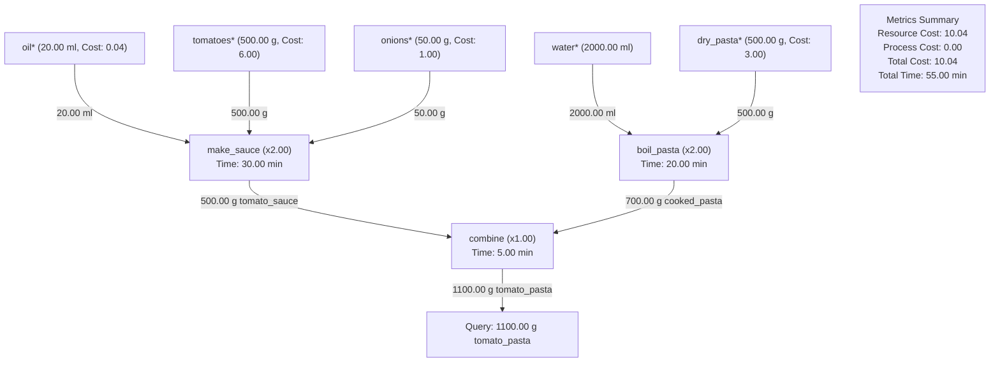

# Examples

Explore real-world Resource Flow recipes and execution plans.

---

## 1. Tomato Pasta Recipe

### DSL Script (`examples/05_tomato_pasta.rf`)

```text
make_sauce [time: 15 min]: 
    250 g tomatoes * [cost: 3.00], 25 g onions * [cost: 0.50], 10 ml oil * [cost: 0.02] 
    -> 250 g tomato_sauce;

boil_pasta [time: 10 min]: 
    250 g dry_pasta * [cost: 1.50], 1000 ml water *
    -> 350 g cooked_pasta;

combine [time: 5 min]: 
    700 g cooked_pasta, 500 g tomato_sauce 
    -> 1100 g tomato_pasta;

make 1100 g tomato_pasta;
```

### Execution Flowchart (Mermaid)



---

## 2. Custom Batch Costs Example

```text
buy_carrots: 300 g carrots * [cost: 20.00] -> 300 g raw_carrots;
prep_soup: 300 g raw_carrots, 500 ml water * [cost: 2.00] -> 800 ml carrot_soup;

make 1600 ml carrot_soup;
```

In this example, requesting `1600 ml carrot_soup` doubles the process scale ($s=2$), scaling total basic inputs to `600 g carrots` (Cost: $40.00) and `1000 ml water` (Cost: $4.00) for a total calculated cost of $44.00.
